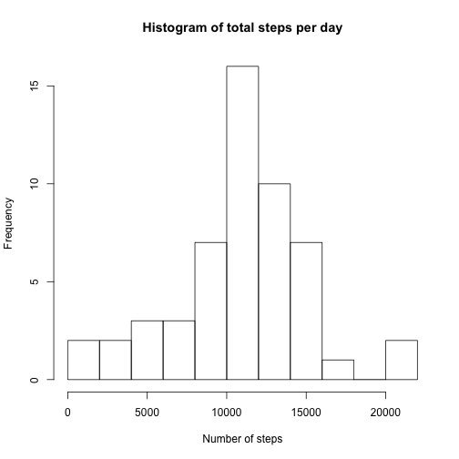
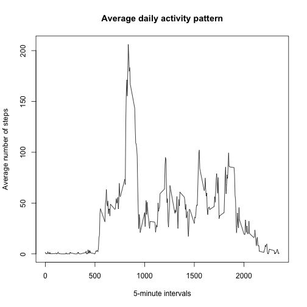
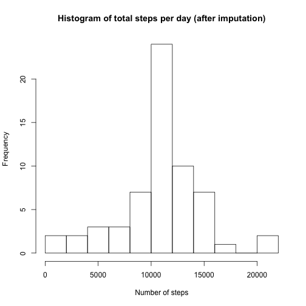
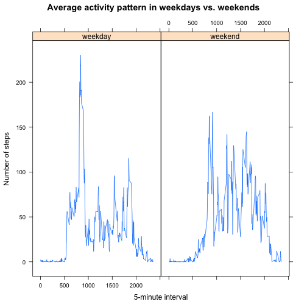

  
**Loading and preprocessing the data**

```r
unzip("activity.zip")
activity<-read.csv("activity.csv",stringsAsFactors=F)
```
  
**Calculate and visualize total/mean number of steps per day, ignore missing values for now**  
Mean and median totol number of steps per day are 10766 and 10765 steps, respectively. 


```r
activity_no_missing <- activity[complete.cases(activity),]
total_per_day<-tapply(activity_no_missing$steps,activity_no_missing$date,sum)
hist(total_per_day,xlab = "Number of steps", ylab = "Frequency", main = "Histogram of total steps per day",breaks=10)
```

 

```r
mean(total_per_day)
```

```
## [1] 10766.19
```

```r
median(total_per_day)
```

```
## [1] 10765
```
  
**Visualize average daily activity pattern**  
The 835th 5-minute interval contains the maximum number of steps - 206 steps averaged across all days. This is also reflected in the time series plot.

```r
mean_per_interval<-tapply(activity_no_missing$steps,activity_no_missing$interval,mean)
plot(x=names(mean_per_interval),mean_per_interval,type="l",xlab="5-minute intervals", ylab="Average number of steps", main="Average daily activity pattern")
```

 

```r
names(which.max(mean_per_interval))
```

```
## [1] "835"
```

```r
max(mean_per_interval)
```

```
## [1] 206.1698
```
  
**Imputing missing values**  
2304 rows contan missing values. Replace missing value with mean for that 5 minute interval from other non-missing days.  
After imputation, the mean and median number of steps taken per day is almost the same as those from using only non-missing observations. This is expected as we used mean steps per interval averaged from non-missing observations.  
However, based on the histogram after imputation, the number of days whose total steps per day are at the mean/median increased compared to the previous histogram.

```r
sum(!complete.cases(activity))
```

```
## [1] 2304
```

```r
#Match intervals with missing "steps" values to mean steps of other intervals
ind<-match(activity$interval[is.na(activity$steps)],names(mean_per_interval))
activity_imputed<-activity
#Replace missing steps for intervals with mean for the same interval from other days.
activity_imputed$steps[is.na(activity$steps)]<-mean_per_interval[ind]
total_per_day_imputed<-tapply(activity_imputed$steps,activity_imputed$date,sum)
hist(total_per_day_imputed,xlab = "Number of steps", ylab = "Frequency", main = "Histogram of total steps per day (after imputation)",breaks=10)
```

 

```r
mean(total_per_day_imputed)
```

```
## [1] 10766.19
```

```r
median(total_per_day_imputed)
```

```
## [1] 10766.19
```
  
**Compare activity patterns for weekdays and weekends**  
From the panel plot, it is clear that on weekdays, there is a higher activity peak,  
with steps well over 200, followed by an extended period of low activity (sitting in front of a computer?).  
On weekends, the activity pattern is more homogeneous, spreading across all day without obvious peaks.

```r
library(lubridate)
#Convert to date
activity_imputed$date<-ymd(activity_imputed$date)
#If weekdays() results belong to Saturday/Sunday, assign to weekend
activity_imputed$dayofweek<-as.factor(ifelse(weekdays(activity_imputed$date) %in% c("Saturday","Sunday"),"weekend","weekday"))
library(dplyr)
#Summarise by interval and weekday/weekend, calculate mean steps per interval
day_interval<-summarise(group_by(activity_imputed,interval,dayofweek),mean_steps=mean(steps))
library(lattice)
#panel plot using lattice, conditioning on weekday/weekend
xyplot(mean_steps ~ interval|dayofweek,data=day_interval,type="l",xlab="5-minute interval", ylab="Number of steps", main = "Average activity pattern in weekdays vs. weekends")
```

 
